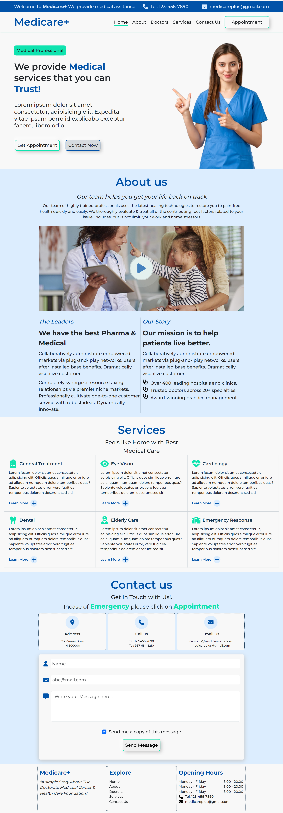

# Medicare+

## Introduction

Medicare+ is a responsive landing medical webpage with contact form and animation.

## Technologies Used

-  HTML, CSS, Javascript, Bootstrap.

## Screenshot

### Desktop version

# Folder Structure

The project structure is organized as follows:

- index.html: The entry point of the webpage.
- CSS: Contains the Styling code for each section 
- assets: Contains the images.

# Contributing

Contributions to the Medicare+ are welcome! If you find any bugs or have suggestions for improvements, please create an issue or submit a pull request.

## Author

My name is Avinash Tallapaneni, and I am a front-end web developer passionate about creating immersive and engaging user experiences. Medicare+ is a project that showcases my skills and dedication to building high-quality web applications.

- GitHub - [Your GitHub Profile](https://github.com/avinash-tallapaneni)
- Twitter - [Twitter Profile](https://twitter.com/TallapaneniAvi)

## Feedback

I appreciate any feedback you have on CineSpectrum. If you have any suggestions, bug reports, or general feedback, please feel free to

# License

This project is licensed under the MIT License.
Feel free to modify the content to match your project and provide additional information as needed.
